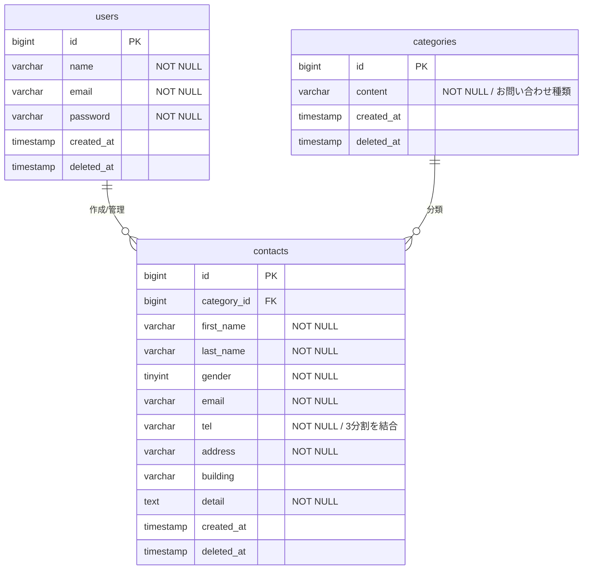

# お問い合わせフォーム（お問い合わせシステム）

このリポジトリは、Laravelを使用したお問い合わせ管理システムです。

## ER図

```mermaid
erDiagram
    users ||--o{ contacts : "作成/管理"
    categories ||--o{ contacts : "分類"

    users {
        bigint id PK
        varchar name "NOT NULL"
        varchar email "NOT NULL"
        varchar password "NOT NULL"
        timestamp created_at
        timestamp deleted_at
    }

    categories {
        bigint id PK
        varchar content "NOT NULL / お問い合わせ種類"
        timestamp created_at
        timestamp deleted_at
    }

    contacts {
        bigint id PK
        bigint category_id FK
        varchar first_name "NOT NULL"
        varchar last_name "NOT NULL"
        tinyint gender "NOT NULL"
        varchar email "NOT NULL"
        varchar tel "NOT NULL / 3分割を結合"
        varchar address "NOT NULL"
        varchar building
        text detail "NOT NULL"
        timestamp created_at
        timestamp deleted_at
    }
```
