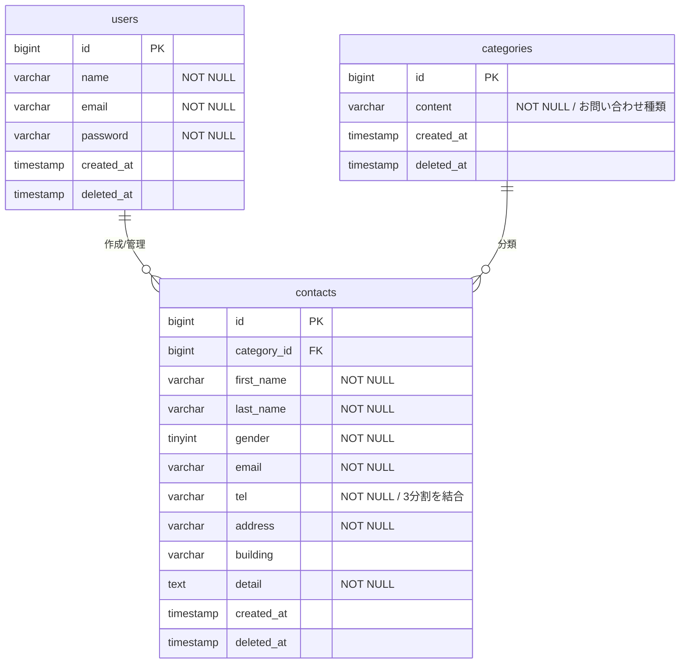

# お問い合わせフォーム（お問い合わせシステム）

このリポジトリは、Laravelを使用したお問い合わせ管理システムです。

## ER図



##  使用技術
- **Framework**: Laravel 8.x
- **Database**: MySQL 8.0
- **Environment**: Docker / Docker Compose
- **Language**: PHP 7.4 / HTML / CSS (Tailwind CSS)

##  機能一覧
- **お問い合わせ入力フォーム**（バリデーション機能付き）
- **確認画面・サンクスページ**
- **管理画面ログイン機能**（Laravel Fortify/Breeze等）
- **お問い合わせ検索・詳細表示**
- **データ削除機能**（論理削除）

##  環境構築
```bash
# 1. リポジトリをクローン
git clone git@github.com:yurikodoi/contact-form-test.git

# 2. フォルダへ移動
cd contact-form-test

# 3. Dockerコンテナの起動
docker-compose up -d --build

# 4. パッケージのインストール
docker-compose exec app composer install

# 5. 環境設定ファイルの作成
docker-compose exec app cp .env.example .env

# 6. アプリケーションキーの生成
docker-compose exec app php artisan key:generate

# 7. マイグレーションとシーディング（初期データ投入）
docker-compose exec app php artisan migrate --seed
